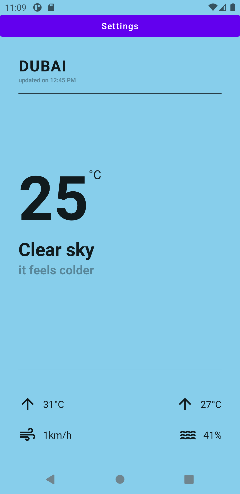
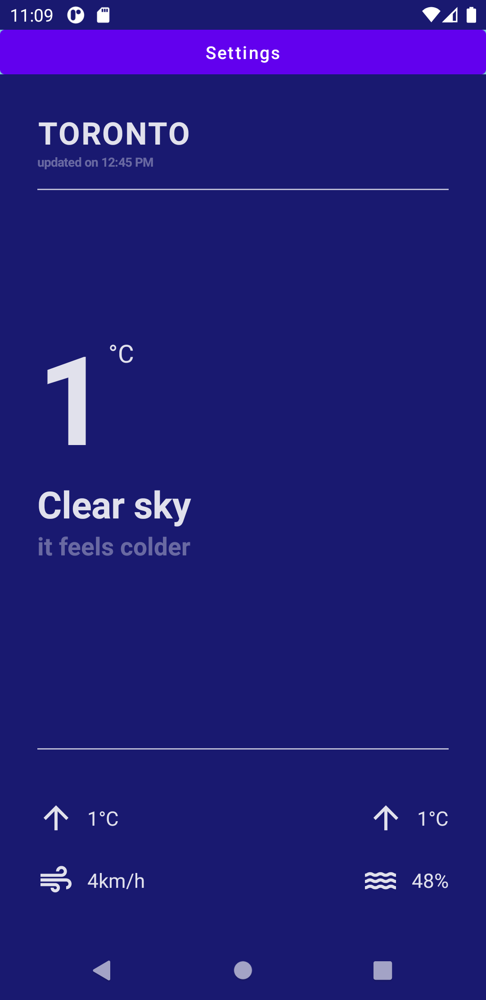
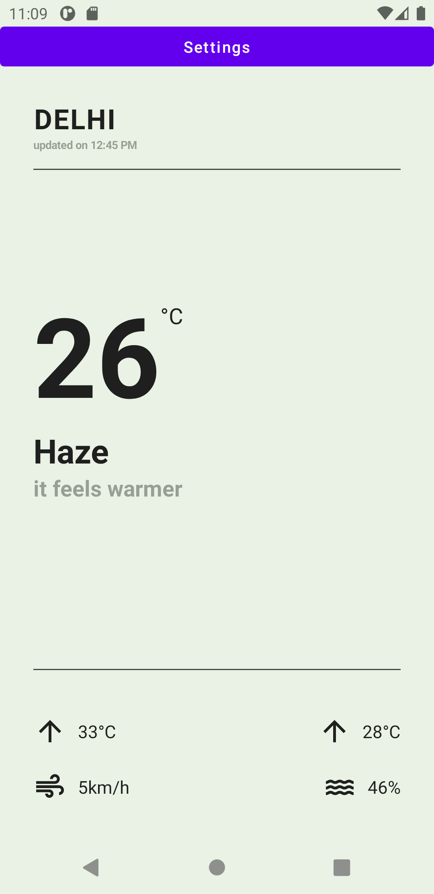

<p align="center">
  
</p>

<p align="center">
Drizzle - Simple Open Source Weather App
</p>
<p align="center">*Know about your weather in style*</p>


  
<details>
  <summary><i>Table of contents</i></summary>

---

- [Features](#features)
- [Demo](#demo)
- [Implementation](#implementation)
- [Usage](#usage)
- [Built with](#built-with)
- [Developing](#developing)
- [Contributing](#contributing)
- [Current Bugs](#current-bugs)
- [Future](#future)
- [License](#license)

---

</details>

### Features
- **Over 3,000+ cities** - Drizzle supports fetching weather information for more than 3,000+ cities around the globe. Wherever in the world you are, Drizzle can help you prepare for the weather.
- **Supports multiple locations** - Drizzle supports fetching multiple locations (upto 3) at the same time, just swipe right and on the main weather screen to view other locations which you may be interested in.
- **Beautiful minimal UI** - Drizzle features a simple and minimal UI. It uses the entire screenspace and illuminates it with the color best depicting the current weather situation. The bold and big fonts provide a clean and simple aesthetic to showcase the weather.
- **Chance of precipitation** - Drizzle features a precipitation chance indication (present in the lower right hand corner) to help you prepare for upcoming rain, snow or hail.
- **Feels like** - Drizzle showcases a "Feels like" rating of the current weather condition. For example, it may be just 1ºC outside, but maybe due to the current wind condition it may be chilly, Drizzle warns the user "It feels colder" to let them know that eventhough it is 1ºC you have to prepare for a much colder temperature. The same also goes for warmness, where Drizzle warns "It feels warmer".

### Demo
Here are some screenshots of the app:




### Implementation
The app takes advantage of Jetpack Compose to do UI rendering. Jetpack Compose is a modern UI library written in and for Kotlin programming language. It helps us write code in a declarative manner. The UI is defined in these `Composable` functions that emit the various other `Composable` UI components that eventually result in the rendering of the UI. It also features constructs that help with the memoization and persistence of the state across multiple `recompositions`.

The app still uses Android `ViewModels` to encapsulate the app logic out from these Composables that are primarily designed to deal with the UI rendering logic. This is primarily driven the by the principle of single responsibility, where the app is composed of functions that can defined under a single feature (or a responsibility).

The actual weather data is provisioned from [OpenWeatherMap](https://openweathermap.org). It is then passed to Retrofit (an API library for Android) to parse the JSON content returned by the API. To give a smooth and fast experience, the network logic is implemented to run using Kotlin Coroutines. You can find the relevant API request code in Hoppscotch: [Request for Weather data](https://hoppscotch.io/?method=GET&url=https://api.openweathermap.org&path=/data/2.5/weather?q=Thunder%2520Bay&appid=&params=%5B%7B%22key%22:%22q%22,%22value%22:%22Thunder%20Bay%22,%22type%22:%22query%22,%22active%22:true%7D,%7B%22key%22:%22appid%22,%22value%22:%22%22,%22active%22:true,%22type%22:%22query%22%7D%5D), and [Request for Forecast Data](https://hoppscotch.io/?method=GET&url=https://api.openweathermap.org&path=/data/2.5/forecast?q=Thunder%2520Bay&appid=&params=%5B%7B%22value%22:%22Thunder%20Bay%22,%22active%22:true,%22type%22:%22query%22,%22key%22:%22q%22%7D,%7B%22active%22:true,%22value%22:%22%22,%22type%22:%22query%22,%22key%22:%22appid%22%7D%5D)

### Usage
To use the app, just install the APK from the Github Releases section! It's that simple!

### Built With
- [Android Studio Canary 14 Arctic Fox](https://developer.android.com/studio/preview)
- [Jetpack Compose Beta 02](https://developer.android.com/jetpack/compose)
- [Kotlin](https://kotlinlang.org/)
- [Retrofit](https://square.github.io/retrofit/)
- [Material Icons Library](https://fonts.google.com/icons?selected=Material+Icons)
- [Google Compose Accompanist Library](https://github.com/google/accompanist)
- [OpenWeatherMap API](https://openweathermap.org/)
- [GSON](https://github.com/google/gson)
- [Hoppscotch 🛸](https://hoppscotch.io/)

### Developing
To set up a local development environment of the app, make sure you create a `gradle.properties` file with a valid API key issued by OpenWeatherMap.
```
OWM_API_KEY=<<openweathermap issued key goes here>>
```
The key is not pushed here on the repo to prevent abuse of the API.

Due to [some current issues with Jetpack Compose Beta 4](https://issuetracker.google.com/issues/184935352), this project uses an older version (Beta 2) and all the dependent libraries (like Accompanist) also are using the older version that support that specific Compose version, this can be easily updated on the `build.gradle` file found on the root of the project in the `compose_version` variable.

This project is built on the Android Studio Canary (codename Arctic Fox) and won't open on Android Studio stable version, hence make sure to check you are using the correct version of Android Studio to work with the project. Some changes might be required in the future to support the different Android Studio releases.
### Contributing
Please contribute using [GitHub Flow](https://guides.github.com/introduction/flow). Create a branch, add commits, and [open a pull request](https://github.com/AndrewBastin/drizzle/compare).

Please read [`CONTRIBUTING`](CONTRIBUTING.md) for details on our [`CODE OF CONDUCT`](CODE_OF_CONDUCT.md), and the process for submitting pull requests to us.
### Current (Known) Bugs
- Updating Settings page currently does not update the weather views on the main screen until the app has restarted.
### Future
- Improved UI
- An app onboarding experience
- Metric and Imperial unit conversions
- Improved Settings Experience
- Weekly forecasts
### License
This project is licensed under the [MIT License](https://opensource.org/licenses/MIT) - see the [`LICENSE`](LICENSE) file for details.
